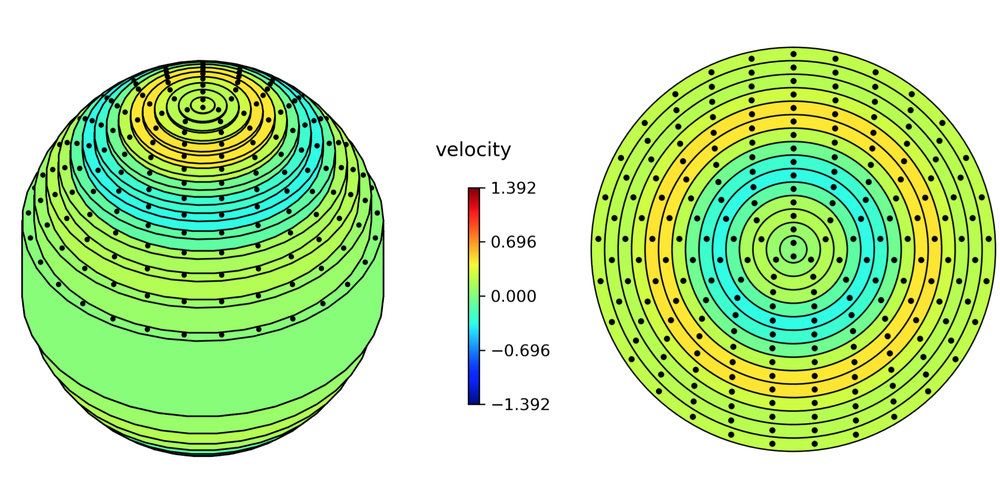

# Torsional Axisymmetric Core Oscillations Visualiser (TACO-VIS)

A python module for animating torsional wave data for fluid planetary cores.

[](https://travis-ci.org/sam-greenwood/taco_vis) [](https://taco-vis.readthedocs.io/en/latest/?badge=latest)

TACO-VIS provides a simple set of python visualisation tools for fluid flow velocity data from fluid planetary interiors with a focus on animating torsional wave models. TACO-VIS is a lightweight module built only upon the common numpy/matplotlib python packages and is free to be used and modified as the user requires.

Animations can be generated simply and quickly with minimal lines of code, e.g.:

```py
import numpy as np
from taco_vis import FLOW

# Import and generate some random data
data = np.random.rand(10,10)

f = FLOW(data)
# Create instance of FLOW class and use it to plot an animation.
f.plot_cylinders_3D(animate=True)
```

<p align="center">
  
</p>

# Dependencies
1. Python 3.5+
2. numpy
3. matplotlib
4. ffmpeg (for saving animations as movie files)

# Installation

Python 3.5+, numpy and matplotlib are required for this module to produce the animations and ffmpeg to save them. Assuming you have at least python 3, numpy and matplotlib installed, clone/download this repository then run the setup file with `python setup.py install` from the command. This allows taco_vis to be imported from within the python environment, otherwise `taco_vis.py` must always be present in your working directory.

ffmpeg can be obtained with instructions from https://ffmpeg.org

# Usage

The documentation can be found at: https://taco-vis.readthedocs.io

Data must be angular velocity values in either a 2D or 3D numpy array. The dimensions of the array correspond to the number of points in radius/time (for 2D) or radius/azimuth/time (3D) repsectively. The data is also assumed to be on a regular grid with radius in the domain [0,1] and azimuth between [0, 2pi].

Animations and figures are generated with the 'FLOW' class, which is initialised with the data array:

```py
from taco_vis import FLOW
f = FLOW(data)
```


There are 3 types of plot available with the following methods: plot_contours, plot_cylinders and plot_cylinders_3D (detailed in full below). Animations or still images may be plotted and/or saved to disk for each of the style of plots provided. The same 3 keyword arguments are available for each:

1. animate (default = False). If True then a matplotlib animation is created, iterating through the time axis of the data. If False then simply a static plot of one time interval of the data will be created.
2. save (default = False). If True then the image (if animate is False) or animation (if animate is True) will not be shown but instead saved to the current working directory.
3. time_idx (default = 0). If animate is False then this specifies the time index along the 3rd dimension of the data to be staically plotted.

#### cylinders

```py
f.plot_cylinders(animate=False, save=False, time_idx=0)
```

This produces a 2D plot of a slice through the equitorial plane with concentric circles representing the concentric cylinders (with as many cylinders as there are radial grid points in the data). A series of black dots are plotted on each cylinder and are advected to visualise the sense of rotation. The cylinders are coloured by the value of velocity at that time interval (right of figure below).


#### cylinders_3D

```py
f.plot_cylinders_3D(animate=False, save=False, time_idx=0)
```

The same as 'cylinders' but instead the plot is a 3D representation of the cylinders within a spherical core (left of figure below).

<p align="center">
  
</p>

#### contours

```py
f.plot_contours(animate=False, save=False, time_idx=0)
```

A filled contour plot of the data is produces, which does not strictly need to be axisymmetric and hence the data array may be 3D (radius, theta, time).

<p align="center">
  
</p>

---

Default settings for the appearance of the plots are attributes of the FLOW class. Current settings can be seen by the call method of the class:

```py
>>> from taco_vis import FLOW
>>> f = FLOW(data)
>>> f()

CURRENT SETTINGS ---------------
speed : 1
colorbar_title : velocity
title : time: %3.1f years
movie_filename : output.mp4
image_filename : output.png
dpi : 200
fps : 24
c_scale : 0.98
--------------------------------
```

Speed: (float) Factor applied to the movement of the texture of the cylinders and cylinders_3D animations. A reasonable value is such that FLOW.speed x velocity is approximately 1.

colorbar_title: (string) The title for the colorbar.

title: (string, with formatting) Title for the figure. Internally the title is set with `plt.title(FLOW.title % FLOW.time[i])`, where `FLOW.time[i]` is the current iterations value for time that is passed into the string with formatting. By default `FLOW.time` is assumed to be an array ranging from 1 through to the size of the last dimension of the data (i.e. number of points in time) but can be set to another array if the user wishes.

movie_filename: (string) filename that movie files will be saved to. Type of movie file (e.g. mp4, avi etc.) is specified by the extension.

image_filename: (string) filename that image files will be saved to. Type of image file (e.g. png, jpeg etc.) is specified by the extension.

dpi: (int) resolution of the save images.

fps: (int) frames per second movie files are saved with.

c_scale: (float) The range of the colorbar which runs from -c_scale through to +c_sale. By default the maximum amplitude within the dataset


# Tests

A test python script is included. Running this script tests a live animation and saving image files that should match those provided in the `/test_files` directory within this repository.

# Example

An example python script that produces the 3D animation of the Cox et al. (2013) dataset is also provided in this repository, called `/cox_et_al_animation.py`. A frame of this animation is shown in this repositories accompanying paper along with the full reference for the paper the dataset is taken from.

# Bug reporting and contributions

If you find a bug, please raise it within the issues on this repository and I'll work with you to fix it. I'm currently not taking external contributions to the code but will endevour to communicate and solve any bugs that are found.

# Known issues

You may run into problems with matplotlib interfacing with ffmpeg to save animations.

If you get an error something along the lines of: `ValueError: Invalid file object: <_io.BufferedReader name=X>` where `X` is some number, your binary of ffmpeg may not be working. This can be common if you are using an environment manager, such as anaconda, that matplotlib is being pointed towards and may be solved by installing the ffmpeg binary to your system yourself and having at the beginning of your python script:
```py
import matplotlib
matplotlib.pyplot.rcParams['animation.ffmpeg_path'] = '/usr/local/bin/ffmpeg'
```
using the file path to the ffmpeg binary (which may be different to the one above) to force it to use that one, rather than the ffmpeg inside the anaconda path.
