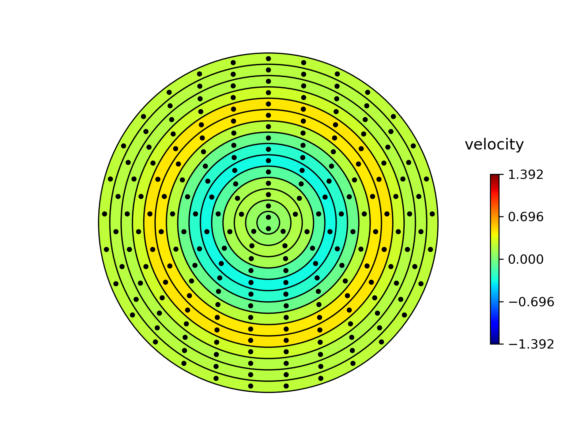
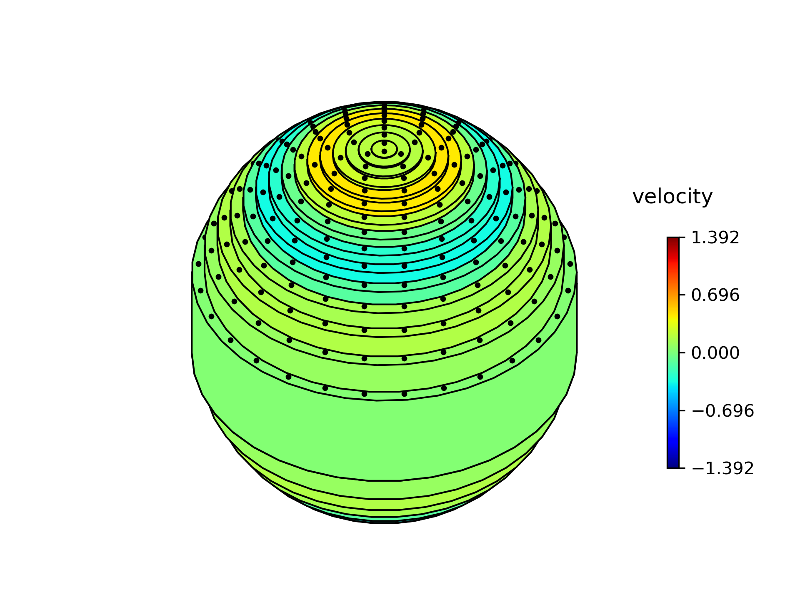
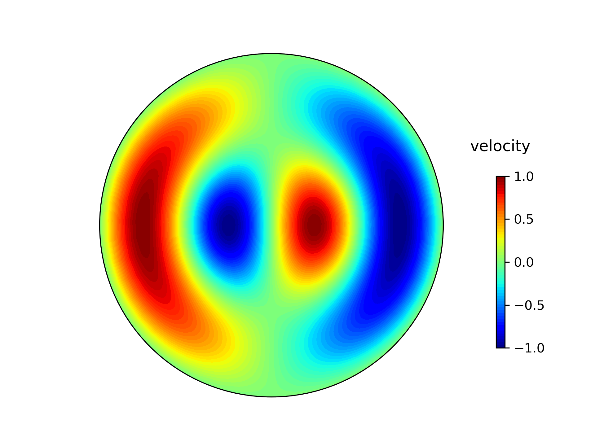

# Summary

TACO-VIS provides a simple set of python visualisation tools for 2D flow velocity data from fluid planetary interiors. It is mainly intended for animating torsional wave models for publication and presentation purposes. TACO-VIS is a lightweight module built only upon the common numpy/matplotlib python packages and is free to be used and modified as the user requires.

# Background

The dynamics of liquid planetary cores is fundamental to planetary-scale phenomena such as the generation of a magnetic field. Understanding the relevant processes is a complex task because the fluid motion includes a wide range of convective and oscillatory behaviour. Visualisation of models, based either on observational data or computer simulations, is a key part of both scientific exploration and communication particularly to non-specialist audiences.

In rapidly-rotating planets such as Earth, one important type of dynamical behaviour is longitudinal 'torsional' oscillations of concentric cylinders aligned with the rotation axis, each of which spans the height of the spherical core.

  

**Figure 1.** Cartoon conceptually showing the differential rotation of fluid cylinders within a sphere.

From an initial starting configuration, the azimuthal (longitudinal) velocity distribution of the cylinders propagates across the core owing to the restoring force of the magnetic field that threads through the cylinders. Because of this spatially dependant modulating effect from the magnetic field, observations of torsional oscillations can constrain the strength of the magnetic field hidden deep inside the core.

Although these torsional oscillations, described by the azimuthal component of velocity, $u_\phi$, can be visualised by static 2D (the cylindrical radius, $s$ and time, $t$) plots [@gillet2010fast; @cox2013forward; @hide2000angular; @teed2018torsional], such diagrams do not communicate the geometry of the waves within the spherical core.

In this paper, we present a simple python module which takes core flow velocity data for torsional waves and produces either static plots or animations. This data may be visualised as a series of rotating concentric cylinders in either a full 3D visualisation (Figure 2) or in 2D as a slice through the equatorial plane (Figure 3). The 2D equatorial plane visualisation may alternatively plot the velocity data by contours rather than concentric cylinders (Figure 4), useful as this does not strictly assume axisymmetry in the data and so flows other than torsional oscillations may actually be represented with this.

To make the cylindrical movement visible, we add a dotted-texture to each cylinder, which is advected as a tracer where positive velocities are taken to be in the eastward (anti-clockwise) direction. The number of cylinders is dictated by the number of radial points in the data and is therefore user controlled.

  

**Figure 2.** 2D visualisation of data from Cox et al. [@cox2013forward] approximated by 15 cylinders. The azimuthal velocity scale shown is non-dimensional.

  

**Figure 3.** 3D visualisation of the same data as the previous figure.

  

**Figure 4.** Simple contour plot of example data that varies sinusoidally in radius and azimuth.

Examples of how to generate animations as well as full documentation are included within the repository for this code.

#### Benefits of TACO-VIS include:

* The tools require only the commonly available Python packages numpy and matplotlib and the well maintained ffmpeg framework.
* Generating an animation can be done in just a simple few lines of code, with examples provided.
* All plots and movies are of publication grade, with user choices for the titles, resolution and frame rate of saved images/movie files.
* The matplotlib animations often draw fast enough to be suitable to be viewed live (dataset depending) without the need to encode to a movie file first.

# Acknowledgements

SG acknowledges internship funding from the School of Earth and Environment, University of Leeds. PWL was partially supported by Natural Environment Research Council grant number NE/I012052/1.

# References
